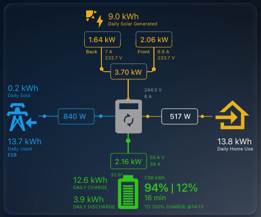

# 🏡 Home Assistant — Solis Solar Setup

This repository serves as a **backup and reference** for my Home Assistant–based solar energy setup powered by a **Solis inverter** and **Dyness Powerbox G2** battery.

---

## ⚙️ Hardware Overview

- **Inverter:** Solis S5-EH1P 5 kW 
- **Datalogger:** Solis S2-WL-ST
- **Solar Panels:** 16× Longi LR7-54HTB-465M (465 W Monocrystalline)
  - PV1 (Back): 7 panels  
  - PV2 (Front): 9 panels  
- **Battery:** Dyness Powerbox G2 10.24kWh

---

## 🔌 Extensions & Integrations

- **[Solis Modbus Extension](https://github.com/Pho3niX90/solis_modbus)**  
  Enables **local control** of the inverter (bypassing Solis Cloud), providing:
  - Data updates every **10–30 seconds**
  - Full **local configuration** control
  - Still reports all data except live house consumption (total still reports so no idea why live isn't reporting) to Solis Cloud

- **[Sunsynk Power Flow Card](https://github.com/slipx06/sunsynk-power-flow-card)**  
  Adds a **real-time energy flow dashboard** in Home Assistant.

---

## 🌞 Power Flow Dashboard

The **power flow card** displays live system stats — solar generation, battery charge, grid import/export, and household load.

Configuration file: [`power-flow-card.yaml`](/power-flow-card.yaml)

---

## 📊 Sensors & Templates

My electricity provider uses **fixed time-of-use (TOU) rates**, so I use a `utility_meter` sensor to monitor and calculate energy costs based on the active rate.

- Data Source: `sensor.meter_total_active_energy_from_grid`  
- Configuration: [`configuration.yaml`](/configuration.yaml)
- Helpers: Rates configurable under `/config/helpers` in Home Assistant

### Key Template Sensors
- **Cost Tracking:** Calculates daily cost per rate (Day, Night, Peak, EV)
- **Export Revenue:** Tracks daily export income
- **Net Cost:** Calculates the day’s total net energy cost

---

## ⚡ Automations

To automatically switch the current rate throughout the day, Home Assistant automations update the `select.electric_meter` entity at defined times.

Configuration: [`automations.yaml`](/automations.yaml)

### Example Schedule:
| Time  | Rate  |
|-------|--------|
| 02:00 | EV     |
| 06:00 | Night  |
| 08:00 | Day    |
| 17:00 | Peak   |
| 19:00 | Day    |
| 23:00 | Night  |

These automations ensure accurate cost tracking across different TOU windows.

---

## 🧮 Rate Configuration

Rates for each tariff can be adjusted directly within Home Assistant via the following helpers:

| Rate Type | Helper ID | Unit | Editable |
|------------|------------|--------|-----------|
| Peak | `input_number.rate_peak` | €/kWh | ✅ |
| Day | `input_number.rate_day` | €/kWh | ✅ |
| Night | `input_number.rate_night` | €/kWh | ✅ |
| EV | `input_number.rate_ev` | €/kWh | ✅ |
| Export | `input_number.rate_export` | €/kWh | ✅ |

---

## 📁 File Summary

| File | Purpose |
|------|----------|
| [`configuration.yaml`](configuration.yaml) | Defines template sensors, utility meters, and rate helpers |
| [`automations.yaml`](automations.yaml) | Handles automatic switching of TOU rates |
| [`power-flow-card.yaml`](power-flow-card.yaml) | Configures the Sunsynk-style power flow visualization |

---

## 💡 Notes

- The **Solis Modbus** extension allows for granular, fast updates without reliance on cloud services.  
- The **Sunsynk Power Flow Card** provides a highly visual summary of real-time system performance.  
- Designed for **daily monitoring**, **rate-based cost tracking**, and **home energy optimization**.
